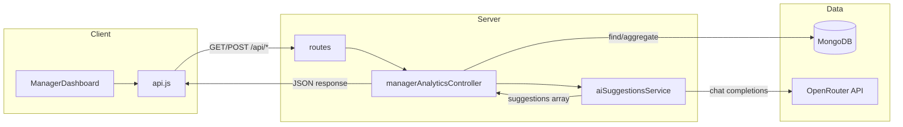

# AI Manager Effectiveness — Data Flow

## What the project does

This is an **AI Manager Effectiveness Scoring** app. It:

1. Lists **managers** and lets you pick one.
2. For that manager, computes an **effectiveness score (0–100)** from:
   - **Employee performance** (1–5 ratings → normalized)
   - **Team feedback** (comments + sentiment 0–1)
   - **Performance metrics** (numeric values 0–100)
3. Shows **AI-generated improvement suggestions** (via OpenRouter) using that same data.

---

## High-level architecture

```
┌─────────────────┐     HTTP (axios)      ┌─────────────────┐     Mongoose      ┌──────────────┐
│  React Client   │  ◄──────────────────► │  Express API    │  ◄──────────────► │   MongoDB    │
│  (port 3000)    │   /api/managers,      │  (port 5000)    │   Manager,        │              │
│  ManagerDashboard│   /manager-analytics  │  server.js      │   Employee,       │  Collections │
└────────┬────────┘   /employees          └────────┬───────┘   Feedback,       └──────────────┘
         │                                            │         PerformanceMetric
         │                                            │
         │                                            ▼
         │                                    ┌─────────────────┐
         │                                    │ OpenRouter API  │
         └────────────────────────────────────│ (AI suggestions)│
                  suggestions JSON            └─────────────────┘
```

---

## Data flow (step by step)

### 1. App load → List managers

| Step | Where | What happens |
|------|--------|----------------|
| 1 | **Client** `ManagerDashboard.js` | `useEffect` runs → calls `getManagers()` from `api.js` |
| 2 | **Client** `api.js` | `GET http://localhost:5000/api/managers` |
| 3 | **Server** `server.js` | Routes to `./routes/managerRoutes` |
| 4 | **Server** `managerRoutes.js` | `GET /` → `Manager.find()` |
| 5 | **DB** | MongoDB returns all `Manager` documents |
| 6 | **Client** | Response stored in `managers` state; first manager’s `_id` set as `selectedManagerId` |

**Data:** `Manager` = `{ name, email, department, experienceYears }` (+ `_id`, timestamps).

---

### 2. Manager selected → Analytics (score + breakdown)

| Step | Where | What happens |
|------|--------|----------------|
| 1 | **Client** | User selects manager → `selectedManagerId` updates → `useEffect` runs |
| 2 | **Client** | `getManagerAnalytics(managerId)` → `GET /api/manager-analytics/:managerId` |
| 3 | **Server** | `managerAnalyticsRoutes.js` → `getManagerAnalytics` in `managerAnalyticsController.js` |
| 4 | **Controller** | `Manager.findById(managerId)`; in parallel: `Employee.find({ managerId })`, `Feedback.find({ managerId })`, `PerformanceMetric.find({ managerId })` |
| 5 | **Controller** | Normalize and average: employee ratings (1–5 → 0–1), feedback sentiment (0–1), metrics (0–100 → 0–1). Build `breakdown`: `avgEmployeeScore`, `avgFeedbackScore`, `avgMetricScore`. |
| 6 | **Controller** | Weighted score: `0.4×employee + 0.3×feedback + 0.3×metrics` → `finalScore` (0–100). Map to `category`: Excellent / Good / Average / Needs Improvement. |
| 7 | **Client** | Response stored in `analytics`; UI shows doughnut chart, breakdown bars, and manager details. |

**Data out:** `{ manager, breakdown, finalScore, category, weights, counts }`.

---

### 3. “Generate AI Suggestions” clicked

| Step | Where | What happens |
|------|--------|----------------|
| 1 | **Client** | `handleGenerateSuggestions()` → `generateManagerSuggestions(managerId)` → `POST /api/manager-analytics/:managerId/suggestions` |
| 2 | **Server** | `managerAnalyticsRoutes.js` → `generateSuggestions` in controller |
| 3 | **Controller** | Same as analytics: load manager, employees, feedbacks, metrics; compute breakdown, finalScore, category. Build **payload** with all of that. |
| 4 | **Controller** | Calls `generateAISuggestions(payload)` from `aiSuggestionsService.js` |
| 5 | **AI Service** | Builds a text prompt (manager info, score, breakdown, employees list, feedbacks, metrics). Calls **OpenRouter** (OpenAI client, baseURL OpenRouter) with fallback models: deepseek-chat, deepseek-r1, llama-3.2-3b. |
| 6 | **AI Service** | Parses response: expect JSON array of strings (suggestions). Rate-limited (min 1.5s between calls). |
| 7 | **Controller** | Returns `{ suggestions: string[] }` |
| 8 | **Client** | Stores in `suggestions` state; “Suggestions” tab shows list of suggestion cards. |

**Data:** No new DB write; same Mongo data is sent to OpenRouter to generate text suggestions.

---

### 4. “Employees” tab → Team list with feedback

| Step | Where | What happens |
|------|--------|----------------|
| 1 | **Client** | When `selectedManagerId` is set, `useEffect` runs → `getEmployeesByManager(managerId)` → `GET /api/employees/manager/:managerId` |
| 2 | **Server** | `employeeRoutes.js` → `Employee.find({ managerId })`, `Feedback.find({ managerId })`. For each employee, attach `feedbacks` where `fromEmployee === emp.name`. |
| 3 | **Client** | Response stored in `employees`; “Employees” tab shows cards (name, role, performance rating, feedback comments + sentiment). |

**Data:** Employees with nested `feedbacks` array for display only.

---

## Database models (MongoDB)

All linked by `managerId` (ObjectId ref to Manager).

| Collection | Key fields | Purpose |
|------------|------------|--------|
| **Manager** | name, email, department, experienceYears | Manager profile |
| **Employee** | name, role, performanceRating (1–5), managerId | Direct reports; rating used in score |
| **Feedback** | fromEmployee, comment, sentimentScore (0–1), managerId | Team feedback; sentiment used in score |
| **PerformanceMetric** | metricName, value, managerId | KPIs; value normalized 0–100 → 0–1 for score |

---

## Summary diagram (Mermaid)


---

## File reference

| Layer | File | Role |
|-------|------|------|
| **Entry** | `server/server.js` | Connects DB, mounts routes, starts Express |
| **DB** | `server/config/db.js` | `mongoose.connect(process.env.MONGO_URI)` |
| **Routes** | `server/routes/managerRoutes.js` | GET/POST managers |
| | `server/routes/employeeRoutes.js` | GET employees by manager |
| | `server/routes/managerAnalyticsRoutes.js` | GET analytics, POST suggestions |
| **Controller** | `server/controllers/managerAnalyticsController.js` | Loads Mongo data, computes score, calls AI service |
| **Service** | `server/services/aiSuggestionsService.js` | Builds prompt, calls OpenRouter, parses JSON array |
| **Models** | `server/models/Manager.js`, `Employee.js`, `Feedback.js`, `PerformanceMetric.js` | Mongoose schemas |
| **Client** | `client/src/App.js` | Router; single route to ManagerDashboard |
| | `client/src/pages/ManagerDashboard.js` | UI, state, API calls |
| | `client/src/services/api.js` | Axios instance; getManagers, getManagerAnalytics, generateManagerSuggestions, getEmployeesByManager |

This is the full data flow for the AI Manager Effectiveness project.